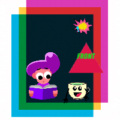

# Olá  🧝‍♂️  Sou Luciana Valentina 
## Desenvolvedora Fron-End  { Junior🐱} 
Sou profissional e talentosa com habilidades de
desenvolvimento de front-end. Me descobri nessa área faz uns 3 anos sou
apaixonada por decifrar problemas desafiadores e criar experiências
deliciosas e únicas através de códigos .
Aprimorei minhas habilidades em
desenvolvimento web.
Desenvolvo sites com HTML, CSS , JavaScript e React.
Sendo uma pessoa diligente, trabalhadora e
orientada para resultados, eu sempre trabalho para alcançar o melhor
resultado em cada projeto que coloco em minhas mãos

  <a href="https://github.com/luvalentinaa">
  
  

 
  
  
  
  
  
  

   
   
  [
    
  ]
   
 

   <a href = "https://drive.google.com/file/d/1llKI0WR9qScn5d1NFTZbTiBeiQY5Y5L4/view?usp=sharing"># Meu curriculo📑</a>
  
  
  
 
  

